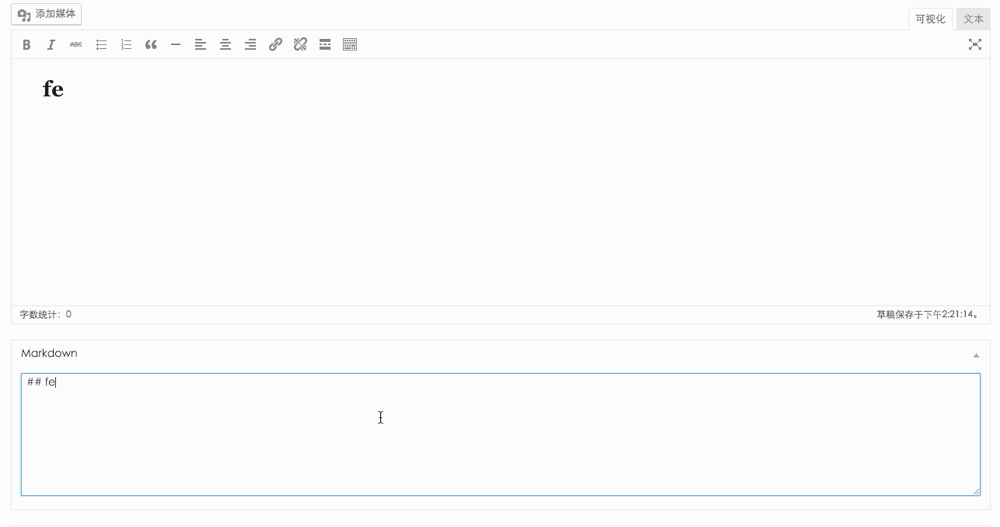

# Markdown-wp
A Markdown Plugin of Wordpress

> Forked from: [风景侠](http://www.scaperow.com/323)  
> Another article: [张河](https://www.zivers.com/post/553.html)

Require & Thanks to
======
[marked](https://github.com/chjj/marked) @chjj

Preview
======

How to Use  
======
1.将 marked.js，makemarked.js 拷贝到 ~\wp-content\{你的主题目录}\js\ 目录下  
2.在 主题的`functions.php`中加入`functions.php`内的代码